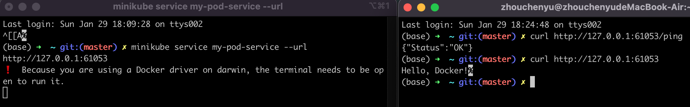

# Practice Kubernetes 

After pushing a container image to Docker Hub.  
https://github.com/zhouchenyu000/Docker  
  
## Kubernetes Pod   
Is the smallest and simplest unit in the Kubernetes object model. It represents a single instance of a running process in your cluster.

Create a yaml file.  

```cmd
# my-first-pod.yaml
apiVersion: v1
kind: Pod
metadata:
  name: my-pod
  labels:
    app: webserver
spec:
  containers:
  - name: pod-demo
    image: zhouchenyu000/docker_test
    ports:
    - containerPort: 8080
```

Create pod.  
```cmd
kubectl create -f my-first-pod.yaml

pod/my-pod created
```

Check pods.  
```cmd
kubectl get pods

NAME     READY   STATUS              RESTARTS   AGE
my-pod   0/1     ContainerCreating   0          9s
```

Wait a minute...  
```cmd
NAME     READY   STATUS    RESTARTS   AGE
my-pod   1/1     Running   0          52m
```

You can use the 'describe' to get information or error messages.  
```cmd
kubectl describe pods my-pod
```

## Kubernetes Service  
Defines a logical set of pods and a policy to access them.  

Create service.  
```cmd
kubectl expose pod my-pod --type=NodePort --name=my-pod-service
service "my-pod-service" exposed
```

Run service.  
```cmd
minikube service my-pod-service --url
http://127.0.0.1:61053
```

```cmd
curl http://127.0.0.1:61053/ping
curl http://127.0.0.1:61053
```

 
